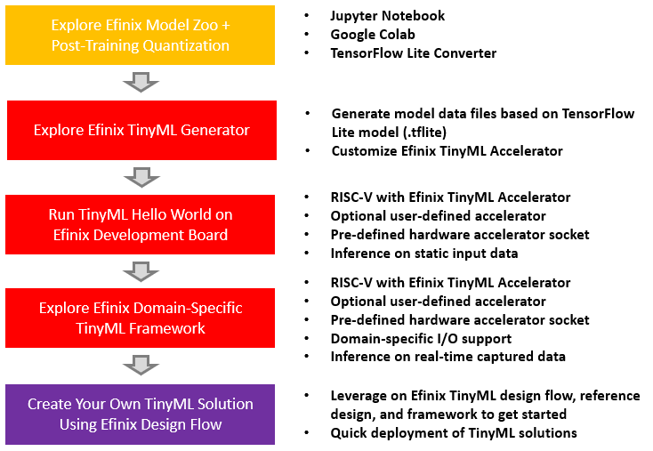

# Efinix TinyML Platform

Welcome to the Efinix TinyML GitHub repo. Efinix offers a TinyML platform based on an open-source TensorFlow Lite for Microcontrollers (TFLite Micro) C++ library running on RISC-V with Efinix TinyML Accelerator. This site provides an end-to-end design flow that facilitates deployment of TinyML applications on Efinix FPGAs. The design flow from Artificial Intelligence (AI) model training, post-training quantization, all the way to running inference on RISC-V with Efinix TinyML Accelerator is presented. In addition, TinyML deployment on Efinix highly flexible domain-specific framework is demonstrated.

- [Overview](#overview)
- [Quick Start](#quick-start)
- [Model Zoo - Training and Quantization](model_zoo/README.md)
- [Efinix TinyML Generator](tools/tinyml_generator/README.md)
- [TinyML Hello World](tinyml_hello_world/README.md)
- [Edge Vision TinyML Framework](tinyml_vision/README.md)
- [Frequently Asked Questions](docs/faq.md)
- [Useful Links](#useful-links)

 

## Overview

Artificial Intelligence (AI) is gaining popularity in a wide range of applications across various domains. AI model training is typically performed using GPUs or CPUs, whereas AI inference for edge applications are typically deployed on mobile GPUs, MCUs, ASIC AI chips or FPGAs. General design flow for deployment of TinyML solution on FPGAs is as follows:

 

 

FPGA provides a viable platform with the offering of low latency and massive hardware parallelism, which is ideal for AI solutions deployment. In addition, compared to other platforms such as ASIC or mobile GPU, FPGA has clear advantage for system-level implementations, where other operations/algorithms are required with hardware acceleration and configurability. FPGA-based AI solutions are typically based on AI accelerator implementations as custom IPs or parameterizable processing elements (PEs). Nevertheless, with the custom IP and PE approaches, the supported network topologies and models are somehow restricted, where the change of a model/topology may require major re-work on the design. As AI research advances rapidly and new models/layers are proposed at fast pace, it is crucial to support the state-of-the-art AI model implementations at quick turnaround time.

 

Efinix presents a flexible and scalable RISC-V based TinyML platform with various acceleration strategies:

- Using **open-source TFLite Micro C++ library** running on Efinix **user configurable Sapphire RISC-V SoC**.
- **Efinix TinyML Accelerator** for accelerating commonly used AI inference layers/operations.
- **Optional user-defined accelerator** to accelerate other compute-intensive layers/operations, which are to be determined **as per application need**.
- **Pre-defined hardware accelerator socket** that is **connected to Direct Memory Access (DMA) controller and SoC slave interface** for data transfer and CPU control, which may be used for pre-processing/post-processing before/after the AI inference.

 

Advantages of Efinix TinyML Platform:

- **Flexible AI solutions** with configurable RISC-V SoC, Efinix TinyML Accelerator, optional user-defined accelerator, hardware accelerator socket to cater for **various applications needs**.
- Support all AI inferences that are supported by the **TFLite Micro library**, which is **maintained by open-source community**.
- **Multiple acceleration options** with different performance-and-design-effort ratio to speed-up overall AI inference deployment.

 

 

### Sapphire RISC-V SoC

Efinix offers a user-configurable, high-performance Sapphire RISC-V SoC based on the VexRiscv core. VexRiscv is a 32-bit CPU using the ISA RISCV32I with extensions, pipeline stages, and a configurable feature set. The SoC has a RISC-V processor, memory, a range of I/O, and interfaces for embedding user functions. User can easily configure the SoC based on application needs using Efinity IP Manager.

 

 

 

### TensorFlow Lite Micro

Tensorflow is an end-to-end open-source machine learning platform. It offers comprehensive, flexible ecosystem of tools, libraries and community resources that facilitate development and deployment of machine learning applications. TensorFlow Lite is part of Tensorflow that provides a mobile library for edge devices. Tensorflow Lite Converter facilitates post-training quantization for converting a trained model to a smaller and more efficient Tensorflow Lite model. In addition, TensorFlow Lite Micro is a C++ library that is designed to be readable, ease of modification and integration, as well as compatible with the regular TensorFlow Lite.

Related links:

- [Understand the C++ library](https://www.tensorflow.org/lite/microcontrollers/library)
- [GitHub: tflite-micro](https://github.com/tensorflow/tflite-micro)
- [Tensorflow Lite Converter - Post Training Quantization](https://www.tensorflow.org/lite/performance/post_training_quantization)

 

### Efinix TinyML Accelerator

Efinix offers a TinyML accelerator, that is compatible with TFLite Micro library, for acceleration of compute-intensive layers/operations in AI inference. Efinix TinyML accelerator is connected to RISC-V through custom instruction interface and connected to AXI master interface for Direct Memory Access (DMA).

Efinix TinyML Accelerator supports two modes, which is customizable by layer type:

1. Lite mode - Lightweight accelerator that consumes less resources.
2. Standard mode - High performance accelerator that consumes more resources.

A GUI-based [Efinix TinyML Generator](tools/tinyml_generator/README.md) is provided to facilitate the customization of the TinyML Accelerator.

 

## Quick Start

For a quick start on Efinix TinyML Platform, combined hex file (FPGA bitstream + RISC-V application binary) for demo design is provided in *quick_start* directory.

List of quick start demo designs:

- [Titanium® Ti60 F225 Development Kit](https://www.efinixinc.com/products-devkits-titaniumti60f225.html)
  - MobilenetV1 Person Detection
  - Yolo Person Detection
  - MediaPipe Face Landmark Detection
- [Titanium® Ti180 M484 Development Kit](https://www.efinixinc.com/products-devkits-titaniumti180m484.html)
  - MobilenetV1 Person Detection
  - Yolo Person Detection
  - MediaPipe Face Landmark Detection

List of supported cameras for quick start demo:
1. Raspberry PI Camera Module v2
   - Sony IMX219 image sensor
2. Google Coral Camera Module
   - Omnivision OV5645 SoC with build-in image signal processor
   - Auto focus, auto exposure control, auto white balance, and more.

Bring up quick start demo design on Efinix development kit by following listed steps below:

1. Set up hardware
   - Refer to *Set Up the Hardware* section in [EVSoC User Guide](https://www.efinixinc.com/support/docsdl.php?s=ef&pn=UG-EVSOC) for targeted development kit.
   - For quick start demo design that uses Google Coral Camera (*\<device\>\_coral\_\<architecture\>\_\<application\>\_demo.hex*),
      - Google Coral Camera and Google Coral Camera connector daughter card are required.
      - Connect the Google Coral Camera connector daughter card to P2 header on Titanium Ti60 F225 Development Board, or P1 header on Titanium Ti180 M484 Development Board.
2. Program hex file using Efinity Programmer
   - Refer to [Efinity Programmer User Guide](https://www.efinixinc.com/support/docsdl.php?s=ef&pn=UG-EFN-PGM) to program quick start demo hex file to targeted development kit using Efinity Programmer in SPI active mode (Ti60F225) or SPI Active using JTAG bridge mode (Ti180M484).
3. Press CRESET button & Demo design is up and running
   - Note that, the demo design may take about a minute for initial loading of the application binary.

As the quick start demo design is programmed through SPI active mode (Ti60F225) or SPI Active using JTAG bridge mode (Ti180M484), the design is stored in flash memory. Since flash is non-volatile memory, the design is retained even after power off. Hence, before loading other design, which is with separate FPGA bitstream and RISC-V application binary (run with Eclipse OpenOCD Debugger), user should erase the flash memory (recommend to erase 8192000 bytes for Ti60F225 or 33554432 bytes for Ti180M484) using Efinity Programmer.

 

To further explore Efinix TinyML Platform:

- Training & Quantization
  - For users who are interested in exploring the model training and post-training quantization flow, refer to [Efinix Model Zoo](model_zoo/README.md) in *model_zoo* directory to get started.
  - For users who would like to skip the training and quantization flow, proceed to try out [TinyML Hello World](docs/tinyml_hello_world.md) design for static input AI inference on FPGAs. Pre-trained and quantized models are included in the TinyML Hello World example designs.
- AI Inference on FPGAs
  - A GUI-based [Efinix TinyML Generator](tools/tinyml_generator/README.md) in *tools/tinyml_generator* directory is provided for generating model data files and customizing Efinix TinyML Accelerator with different accelerator modes and levels of parallelism. User may skip this step for initial exploration of example designs provided by Efinix TinyML Platform.
  - TinyML Hello World design is provided for user to run AI inference on FPGAs based on TFLite Micro library with Efinix TinyML Accelerator.
  - AI inference with static input is crucial to facilitate model verification against golden reference model. In addition, profiling can be performed to identify compute-intensive operation/layer for acceleration.
  - Refer to [TinyML Hello World](tinyml_hello_world/README.md) to get started.
- TinyML Solution on FPGAs
  - Flexible domain-specific framework is vital to facilitate quick deployment of TinyML solution on FPGAs.
  - To leverage on Efinix domain-specific framework for TinyML vision solution deployment, refer to [Edge Vision TinyML Framework](tinyml_vision/README.md) to get started.

 

Refer to [Frequently Asked Questions](docs/faq.md) for general questions and guidelines for creating your own TinyML solution using Efinix TinyML platform.

 

 

## Useful Links

- [Edge Vision SoC (EVSoC) Webpage](https://www.efinixinc.com/edge-vision-soc.html)
- [GitHub: EVSoC](https://github.com/Efinix-Inc/evsoc)
- [EVSoC User Guide](https://www.efinixinc.com/support/docsdl.php?s=ef&pn=UG-EVSOC)
- [Sapphire RISC-V SoC Hardware and Software User Guide](https://www.efinixinc.com/support/docsdl.php?s=ef&pn=SAPPHIREUG)
- [Titanium Ti60 F225 Development Kit User Guide](https://www.efinixinc.com/support/docsdl.php?s=ef&pn=Ti60F225-DK-UG)
- [Titanium Ti180 M484 Development Kit User Guide](https://www.efinixinc.com/support/docsdl.php?s=ef&pn=Ti180M484-DK-UG)