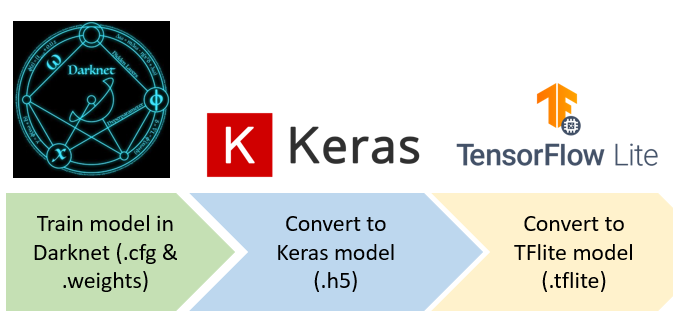

# Model Conversion Flow

## Conversion from Tensorflow to TFLite


- The pre-trained model on Tensorflow framework can be loaded from a pre-trained checkpoint (.ckpt) or pre-trained network library.
- The final model will be saved as protobuf file (.pb).
- The model is then loaded on TFLite using TFLite converter :
  
  ```
  import tensorflow as tf
  converter = tf.lite.TFLiteConverter.from_saved_model(saved_model_dir)
  ```

- Refer to [MobilenetV1 Person Detection](../model_zoo/mobilenetv1_person_detection/mobilenetv1_person_detection.ipynb) example for Tensorflow training flow and full integer quantization.

## Conversion from Keras to TFLite


- The pre-trained model on Keras framework with Tensorflow backend can be loaded from a pre-trained checkpoint (.ckpt) or pre-trained network library.
- The final trained model will be saved as protobuf file (.pb)  or Keras H5 file (.h5).
- The model is then loaded on TFLite using TFLite converter based on final model saved:
  
  1. Loading from Saved Model (.pb)     
     
     ```
     import tensorflow as tf
     converter = tf.lite.TFLiteConverter.from_saved_model(saved_model_dir)
     ```
  2. Loading from Keras Model (.h5)     
     
     ```
     import tensorflow as tf
     converter = tf.lite.TFLiteConverter.from_keras_model(model)
     ```

- Reference for training and quantization flow: 
  
  1. Saved Model (.pb) example : [Face Landmark Detection](../model_zoo/mediapipe_face_landmark_detection/mediapipe_face_landmark_detection.ipynb) and [Keyword Spotting](../model_zoo/ds_cnn_keyword_spotting/ds_cnn_keyword_spotting.ipynb) 
  2. Keras Model (.h5) example : [Image Classification](../model_zoo/resnet_image_classification/resnet_image_classification.ipynb)

## Conversion from Darknet to TFLite



- The [Darknet](https://pjreddie.com/darknet/) framework model trained can be converted to Keras Model with Tensorflow backend by using script.
- The script will read Darknet config and weights, which then will create Keras model with TF backend.   
- The generated .h5 model will then be converted to TFLite using TFLite converter ([Keras Conversion](#conversion-from-keras-to-tflite)).
- Refer to [Yolo Person Detection](../model_zoo/yolo_person_detection/yolo_person_detection.ipynb) example for Darknet training and quantization flow.

## Conversion from PyTorch to TFLite


- PyTorch framework uses NCHW format for input while Tensorflow framework uses NHWC format for input. Thus, the conversion to Tensorflow must be together with input format converted.
- The final trained model in PyTorch is saved in .pt or .pth format with NCHW format.    
  ```
  torch.save(model, <model_name>) 
  ```

- The model is then converted to ONNX (Open Neural Network Exchange) format with NCHW format:    
  ```
  torch.onnx.export(model, <example_input>, <onnx_model>, verbose=True, input_names=input_names, output_names=output_names)
  ```

- To simplify the conversion of ONNX to TFLite , onnx2tf library is used. The library will take ONNX model with NCHW format, and convert to Tensorflow with NHWC format, and will use the Tensorflow saved model to convert to TFLite model with quantization (using -o iqt argument):    
  ```
  onnx2tf -i <onnx_model> -oiqt
  ```

- Download the [PyTorch to TFLite](https://www.dropbox.com/s/4koirzj5oe1lob4/PyTorch_TFLite_MNIST.ipynb?dl=0) example for full training and quantization flow.
