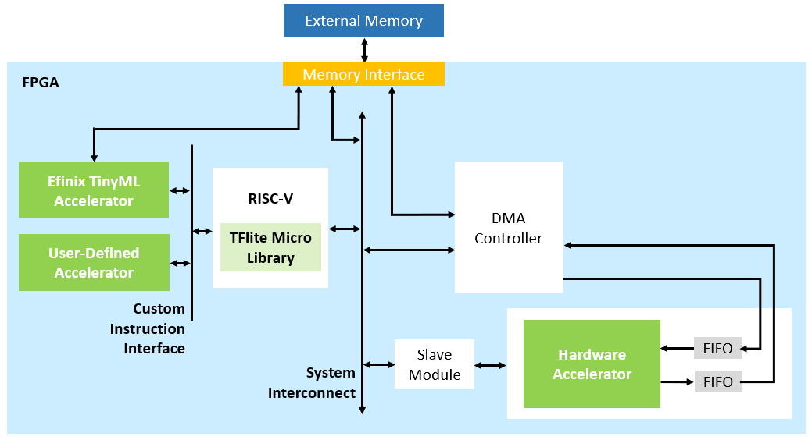

# TinyML Hello World

Efinix TinyML Hello World design is targeted for running AI inference on static input data. Inference on static input data is important to verify the overall inference process of a specific trained and quantized model is correct. The obtained inference outputs can be used to cross-check against the golden reference model in equivalent Python or PC-based C++ implementations. In addition, layer-by-layer profiling can be performed to identify compute-intensive operation/layer for acceleration. Furthermore, user may adjust the TinyML accelerator RTL parameter for different levels of parallelism based on targeted application.

TinyML Hello World design is composed of Efinix Sapphire RISC-V SoC, DMA controller, TinyML accelerator, pre-defined accelerator socket, and reserved interface for optional user-defined custom instructions.

 

List of static inference examples:
1. Yolo Pico Person (*yolo_pico*) - Trained with Darknet framework using Yolo architecture to perform person detection.
2. Person detection (*pdti8*) - Trained with Tensorflow using MobilenetV1 architecture to perform human presence detection.
3. Image classification (*imgc*) - Trained with Tensorflow using ResNet architecture to perform classification (CIFAR10 - 10 classes).

Refer to the *model_zoo* directory for more details on the related model training and quantization.

 

## Get Started
The example designs are implemented on:
- [Titanium® Ti60 F225 Development Kit](https://www.efinixinc.com/products-devkits-titaniumti60f225.html)

Efinity® IDE is required for project compilation and bitstream generation, whereas RISC-V SDK (includes Eclipse, OpenOCD Debugger, etc) is used to manage RISC-V software projects and for debugging purposes.

 

Bring up TinyML Hello World design on Efinix development kit by following listed steps below:
1. Set up hardware
   - Refer to *Set Up the Hardware* section in [EVSoC User Guide](https://www.efinixinc.com/support/docsdl.php?s=ef&pn=UG-EVSOC) for targeted development kit.
   - For TinyML Hello World design, the connections to camera and mini-DSI panel are not required.
2. Using Efinity software
   - Pre-compiled bitstream .hex (for Programmer SPI active mode) and .bit (for Programmer JTAG mode) files are provided in Efinity project(s) in *tinyml_hello_world* directory. User may skip Efinity project compilation by using the provided bitstream.
   - To compile TinyML Hello World design,
      - Open Efinity project (*tinyml_hello_world/\*/tinyml_soc.xml*).
      - Generate all included IPs in the IP list.
      - Compile
   - Program FPGA bitstream to targeted development kit using Efinity Programmer.
   - Note that,
      - User is required to generate SapphireSoc in IP list (if not done), prior to proceed with using RISC-V SDK for building software applications.
      - Whenever user generates/re-generates SapphireSoc IP, content in *tinyml_hello_world/\*/embedded_sw* folder will be generated/overwritten. User is required to replace the provided file(s) in *tinyml_hello_world/\*/replace_files* folder into respective directories:
         - bsp.h in *tinyml_hello_world/\*/embedded_sw/SapphireSoc/bsp/efinix/EfxSapphireSoc/include* folder
         - default.ld in *tinyml_hello_world/\*/embedded_sw/SapphireSoc/bsp/efinix/EfxSapphireSoc/linker* folder
3. Using RISC-V SDK
   - Setup Eclipse workspace at *tinyml_hello_world/\*/embedded_sw/SapphireSoc* directory.
   - Window -> Preferences -> C/C++ -> Build -> Environment (for C/C++ compilation with O3 flag, optimize for speed performance)
      - *BENCH* set to *yes*
      - *DEBUG* set to *no*
      - *DEBUG_OG* set to *no*
   - TinyML Hello World software apps are in *tinyml_hello_world/\*/embedded_sw/SapphireSoc/software/tinyml* directory.
   - Refer to *Using Eclipse and OpenOCD* section in [EVSoC User Guide](https://www.efinixinc.com/support/docsdl.php?s=ef&pn=UG-EVSOC) for other general setting and steps for running the static inference example software applications.

 

Software Tools Version:
- [Efinity® IDE](https://www.efinixinc.com/support/efinity.php) v2021.2.323.4.6
- [RISC-V SDK](https://www.efinixinc.com/support/ip/riscv-sdk.php) v1.4