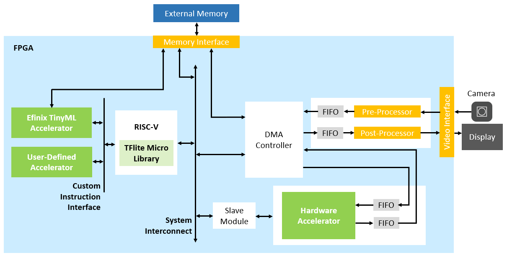

# Edge Vision TinyML Framework

Edge Vision TinyML framework is a domain-specific TinyML framework for vision and AI applications. It is using Efinix [Edge Vision SoC (EVSoC) framework](https://github.com/Efinix-Inc/evsoc) as backbone for AI solutions. The key features of EVSoC framework are as follows:
- **Modular building blocks** to facilitate different combinations of system design architecture.
- **Established data transfer flow** between main memory and different building blocks through DMA.
- **Ready-to-deploy** domain-specific **I/O peripherals and interfaces** (SW drivers, HW controllers, pre- and post-processing blocks are provided).
- Highly **flexible HW/SW co-design** is feasible (RISC-V performs control & compute, HW accelerator for time-critical computations).
- Enable **quick porting** of users' design for **edge AI and vision solutions**.

 

 

List of video streaming inference demo:
1. Person detection demo (*evsoc_pdti8*)
   - Trained with Tensorflow using MobilenetV1 architecture to perform human presence detection
   - Input to model 96x96 grayscale video frame
   - Hardware accelerator - Nearest neighbor downscaling, RGB to grayscale, Pack output pixels to DMA channel data width

Refer to the *model_zoo* directory for more details on the related model training and quantization.

 

## Get Started
The TinyML demo design is implemented on:
- [Titanium® Ti60 F225 Development Kit](https://www.efinixinc.com/products-devkits-titaniumti60f225.html)

Efinity® IDE is required for project compilation and bitstream generation, whereas RISC-V SDK (includes Eclipse, OpenOCD Debugger, etc) is used to manage RISC-V software projects and for debugging purposes.

 

Bring up Edge Vision TinyML demo design on Efinix development kit by following listed steps below:
1. Set up hardware
   - Refer to *Set Up the Hardware* section in [EVSoC User Guide](https://www.efinixinc.com/support/docsdl.php?s=ef&pn=UG-EVSOC) for targeted development kit.
2. Using Efinity software
   - Pre-compiled bitstream .hex (for Programmer SPI active mode) and .bit (for Programmer JTAG mode) files are provided in Efinity project(s) in *tinyml_vision* directory. User may skip Efinity project compilation by using the provided bitstream.
   - To compile Edge Vision TinyML demo design,
      - Open Efinity project (*tinyml_vision/\*/edge_vision_soc.xml*).
      - Generate all included IPs in the IP list.
      - Compile
   - Program FPGA bitstream to targeted development kit using Efinity Programmer.
   - Note that,
      - User is required to generate SapphireSoc in IP list (if not done), prior to proceed with using RISC-V SDK for building software applications.
      - Whenever user generates/re-generates SapphireSoc IP, content in *tinyml_vision/\*/embedded_sw* folder will be generated/overwritten. User is required to replace the provided file(s) in *tinyml_vision/\*/replace_files* folder into respective directories:
         - bsp.h in *tinyml_vision/\*/embedded_sw/SapphireSoc/bsp/efinix/EfxSapphireSoc/include* folder
         - default.ld in *tinyml_vision/\*/embedded_sw/SapphireSoc/bsp/efinix/EfxSapphireSoc/linker* folder
3. Using RISC-V SDK
   - Setup Eclipse workspace at *tinyml_vision/\*/embedded_sw/SapphireSoc* directory.
   - Window -> Preferences -> C/C++ -> Build -> Environment (for C/C++ compilation with O3 flag, optimize for speed performance)
      - *BENCH* set to *yes*
      - *DEBUG* set to *no*
      - *DEBUG_OG* set to *no*
   - Edge Vision TinyML software app(s) is in *tinyml_vision/\*/embedded_sw/SapphireSoc/software/tinyml* directory.
   - Refer to *Using Eclipse and OpenOCD* section in [EVSoC User Guide](https://www.efinixinc.com/support/docsdl.php?s=ef&pn=UG-EVSOC) for other general setting and steps for running the demo software applications.

 

Software Tools Version:
- [Efinity® IDE](https://www.efinixinc.com/support/efinity.php) v2021.2.323.4.6
- [RISC-V SDK](https://www.efinixinc.com/support/ip/riscv-sdk.php) v1.4
