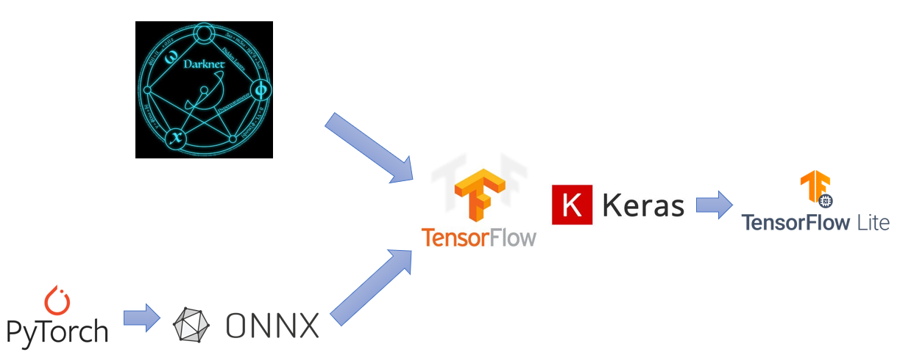
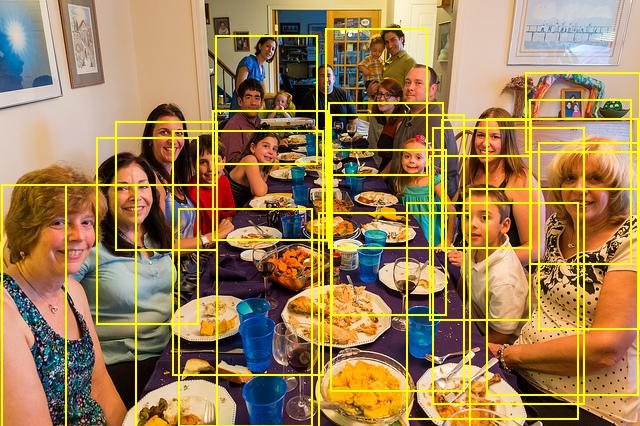
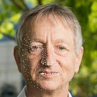

# Welcome to Model Zoo

The Model Zoo - training & quantization flow is developed in Jupyter Notebook to run on Google Colab platform.

<br />

List of models in Model Zoo:

1. [Yolo Person Detection](#yolo-person-detection) - Trained with Tensorflow using Yolo architecture to perform person detection.
2. [MobilenetV1 Person Detection](#mobilenetv1-person-detection) - Trained with Tensorflow framework using MobilenetV1 architecture to perform human presence detection.
3. [ResNet Image Classification](#resnet-image-classification) - Trained with Tensorflow framework using ResNet architecture to perform object classification.
4. [DS-CNN Keyword Spotting](#ds-cnn-keyword-spotting) - Trained with Tensorflow framework using DS-CNN architecture to perform keyword spotting on speech command.
5. [MediaPipe Face Landmark Detection](#mediapipe-face-landmark-detection) - A pre-trained Tensorflow framework obtained using MediaPipe architecture to perform face landmark detection
6. [Deep AutoEncoder Anomaly Detection](#deep-autoencoder-anomaly-detection) - Trained with Tensorflow framework using Deep AutoEncoder architecture in detecting anomalies in machine operating sounds

<br />

The summary of each model is shown below:

| Application          | Framework  | Trained Model format | Model       | Input Size | Dataset           | Quality Target (%) |
| -------------------- | ---------- | -------------------- | ----------- | ---------- | ----------------- | ------------------ |
| Person Detection     | Darknet    | .cfg, .weights       | Yolo        | 96x96x3    | COCO(person)      | 20.30 (mAP@0.5)    |
| Person Detection     | Tensorflow | .pb                  | MobilenetV1 | 96x96x1    | Visual Wake Words | 84.0               |
| Image Classification | Tensorflow | .h5                  | ResNet      | 32x32x3    | CIFAR10           | 85.0               |
| Keyword Spotting     | Tensorflow | .pb                  | DS-CNN      | 49x10x1    | Speech Commands   | 90.0               |
| Face Landmark        | Tensorflow | .pb                  | MediaPipe   | 192x192x3  | Charade           | 468(3D Landmark)   |
| Anomaly Detection    | Tensorflow | .h5                  | Deep AutoEncoder   | 1x640  | ToyADMOS            | 0.85 (AUC)   |

<br />

At the end of each training and quantization flow, user is expected to obtain tflite model file which will be used by [Efinix TinyML Generator](../tools/tinyml_generator/README.md) for accelerator customization and model file generation.

## Quick Start

The training flows are developed on Jupyter Notebook. 

*Note : It is recommended to run on Google Colab as it has pre-installed required libraries for AI training. User may run the Jupyter Notebook on local machine with required libraries installed.*

### Running on Google Colab (Recommended)

1. Access Colab through [here](https://colab.research.google.com/).
2. Ensure that the runtime is set to GPU (Navigate to: Runtime -> Change runtime type -> Hardware accelerator -> pick GPU). 
   *Note: Some training flow may require higher disk space , thus subscription to Google Colab Pro may be required*
3. Upload the desired training notebook (.ipynb).     
   - The training notebook can be obtained at the directory below: 
     
     ```
     ├── model_zoo
     │   └── ds_cnn_keyword_spotting
     │        └── ds_cnn_keyword_spotting.ipynb
     │   └── mediapipe_face_landmark_detection
     │        └── mediapipe_face_landmark_detection.ipynb
     │   └── mobilenetv1_person_detection
     │        └── mobilenetv1_person_detection.ipynb
     │   └── resnet_image_classification
     │        └── resnet_image_classification.ipynb
     │   └── yolo_person_detection
     │        └── yolo_person_detection.ipynb
     │   └── deep_autoencoder_anomaly_detection
     │        └── deep_autoencoder_anomaly_detection.ipynb

     ```
4. Run the training flow.

## Model Conversion

The Model Zoo offers conversion to TFLite from different framework such as PyTorch, DarkNet, Tensorflow and Keras:



Refer to [Model Conversion Flow](../docs/model_conversion.md) to understand the conversion from each framework.

## Yolo Person Detection

### Training

- The model is developed using Darknet framework, which supports CPU and GPU compilation (Refer to: https://pjreddie.com/darknet/ and https://github.com/pjreddie/darknet to get detailed implementation on how to use Darknet framework in developing model).
- The model follows Yolo architecture (a variant based on Yolo-Fastest architecture), real-time object detection algorithm that identifies specific objects in videos, live feeds, or images.
- The model is trained with 119K training images, and 5K test images. The training steps took to get the final model are 500,000 steps.
- A pre-trained weight is included , which has been trained for 500,000 steps.

### Post-Training

- The final model obtained under Darknet framework is .weights, which will be converted to Keras H5 format. 
- The H5 model is then converted to quantized tflite format using TFLite converter and post-training quantization as defined in Tensorflow API:
  - Convert to TFLite : https://www.tensorflow.org/lite/convert
  - Quantized TFLite  : https://www.tensorflow.org/lite/performance/post_training_quantization
- The in-house developed script will perform conversion to TFLite and quantized TFLite, and evaluate the model by comparing the accuracy with original model to ensure less accuracy drop when running on quantized model.

### Interpreting Model Detection Boxes

A YOLO model generates a list of detection boxes in the format such as follows:

```
0.07847815006971359, 0.4994014963507652, 0.3384588211774826, 0.9360917761921883, 0.28339157, 0.2707193
```

where:

- `x_min`: 0.07847815006971359
- `y_min`: 0.4994014963507652
- `x_max`: 0.3384588211774826
- `y_max`: 0.9360917761921883
- `objectness`: 0.28339157
- `class_probabilities`: 0.2707193 (classes of values)

The detection box coordinates are finally converted to match the input image resolution (`width`, `height`):

```
box_x_min = x_min * width
box_y_min = y_min * height
box_x_max = x_max * width
box_y_max = y_max * height
```



<br />

## MobilenetV1 Person Detection

### Training

- The model is developed by referring to TFLite example of person detection:   
  - Reference: https://github.com/tensorflow/tflite-micro/blob/main/tensorflow/lite/micro/examples/person_detection/training_a_model.md
      
- The model is using MobilenetV1 architecture, which is a stack of 14 of these depthwise separable convolution layers with an average pool, then a fully-connected layer followed by a softmax at the end.     
- The model is trained using tensorflow framework (specifically TensorflowV1).      
- Visual Wake Word Dataset is used, where images are converted to grayscale for model training. The model is trained to classify two classes:      
  ```
  person
  no person
  ```    
- The model is trained with 1 Million Epoch to reach the highest accuracy of 84%.    
- Pre-trained checkpoints for 100K steps training is included, which will return 74% accuracy upon evaluation.

### Post-Training

- Upon training the model, the final checkpoint TF model will need to be converted to frozen graph format by generating model graph and combined with final checkpoint trained weight (Reference: https://github.com/tensorflow/tflite-micro/blob/main/tensorflow/lite/micro/examples/person_detection/training_a_model.md)
- The frozen model is then converted to TFLite with quantization using TFLite converter and post-training quantization technique:
  - Convert to TFLite : https://www.tensorflow.org/lite/convert
  - Quantized TFLite  : https://www.tensorflow.org/lite/performance/post_training_quantization

<br />

## ResNet Image Classification

### Training

- The model is developed by referring to TFLite example of image classification (Reference : https://github.com/mlcommons/tiny/tree/master/benchmark/training/image_classification)
- The model uses ResNet architecture, developed under Keras API and tensorflow framework (Reference: https://github.com/mlcommons/tiny/blob/master/benchmark/training/image_classification/keras_model.py)
- The model is trained with 50000 training images and 10000 test images, consisting of 10 different classes, which are:
  
  ```
  airplane
  automobile
  bird
  cat
  beer
  dog
  frog
  horse
  ship
  truck
  ```

- The model is trained with 500 steps. The dataset is divided into five training batches and one test batch, each with 10000 images. The test batch contains exactly 1000 randomly-selected images from each class. The training batches contain the remaining images in random order, but some training batches may contain more images from one class than another. Between them, the training batches contain exactly 5000 images from each class.
  
  - A pre-trained Keras .h5 model is included, which is trained until the final 500 steps. 

### Post-Training

- Upon training the model, the H5 model obtained is converted to quantized tflite format using TFLite converter and post-training quantization as defined in Tensorflow API:
  - Convert to TFLite : https://www.tensorflow.org/lite/convert
  - Quantized TFLite  : https://www.tensorflow.org/lite/performance/post_training_quantization

<br />

## DS-CNN Keyword Spotting

### Training

- The model is developed by referring to example of keyword spotting (Reference : https://github.com/mlcommons/tiny/tree/master/benchmark/training/keyword_spotting)
- The model uses DS-CNN architecture, developed under Keras API and tensorflow framework (Reference: https://github.com/mlcommons/tiny/blob/master/benchmark/training/keyword_spotting/keras_model.py)
- The model is trained with 85511 training datapoint, 10102 validation and 4890 test datapoint, which were extracted from audio into small speech vocabulary dataset. The output consist of 12 different classes, which are: 
  ```
  "Down" "Go", "Left", "No", "Off", "On", "Right",
  "Stop", "Up", "Yes", "Silence", "Unknown"
  ```

- The model is trained with 36 Epoch, achieving  accuracy of 96% on validation set and 92% accuracy on test set. The overall final accuracy achieved is 90%.

- A pre-trained protobuf file (.pb) is included, which is trained until 36 Epoch.

### Post-Training

- Upon training the model, the Tensroflow .pb model obtained is converted to quantized tflite format using TFLite converter and post-training quantization as defined in Tensorflow API:
  - Convert to TFLite : https://www.tensorflow.org/lite/convert
  - Quantized TFLite  : https://www.tensorflow.org/lite/performance/post_training_quantization

<br />

## MediaPipe Face Landmark Detection

### Training

- The model is obtained from Mediapipe solution (Reference : https://google.github.io/mediapipe/solutions/face_mesh.html)
- The model are able to estimate up to 468 3D face landmarks. A sample is shown below: 



### Post-Training

- The pre-trained Tensroflow .pb model obtained is converted to quantized tflite format using TFLite converter and post-training quantization as defined in Tensorflow API:
  - Convert to TFLite : https://www.tensorflow.org/lite/convert
  - Quantized TFLite  : https://www.tensorflow.org/lite/performance/post_training_quantization

## Deep AutoEncoder Anomaly Detection
### Training

- The model is developed by referring to example of anomaly detection (Reference : https://github.com/mlcommons/tiny/tree/master/benchmark/training/anomaly_detection)
- The model uses Deep AutoEncoder architecture, developed under Keras API and tensorflow framework (Reference: https://github.com/mlcommons/tiny/blob/master/benchmark/training/anomaly_detection/keras_model.py)
- The model is trained with ToyADMOS dataset, whereby ToyCar Machine Type is selected for training. 
- The output is derived based on average score of slices from each audio. The sample is shown below:
```
normal_id_01_00000000.wav	6.95342025
normal_id_01_00000001.wav	6.363580014
normal_id_01_00000002.wav	7.048401741
normal_id_01_00000003.wav	6.151557502
normal_id_01_00000004.wav	6.450118248
normal_id_01_00000005.wav	6.368985477
```
 - A pre-trained Keras .h5 model is included, which is trained until the final 100 epochs. 

### Post-Training
- Upon training the model, the H5 model obtained is converted to quantized tflite format using TFLite converter and post-training quantization as defined in Tensorflow API:
  - Convert to TFLite : https://www.tensorflow.org/lite/convert
  - Quantized TFLite  : https://www.tensorflow.org/lite/performance/post_training_quantization


**NOTE:** _The provided full training flow for Yolo Person Detection might take up to ~40GB during execution. Google Colab free version with GPU enabled only supports up to ~38GB, thus subscription to Google Colab Pro may be required._
