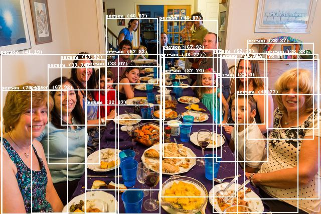

# Welcome to Model Zoo
The Model Zoo - training & quantization flow is developed in Jupyter Notebook to run on Google Colab platform.

<br />

List of models in Model Zoo:
1. [Yolo Pico Person](#yolo-pico-person) - Trained with Darknet framework using Yolo architecture for person detection.
2. [Person Detection](#person-detection) - Trained with Tensorflow framework using MobilenetV1 architecture to perform human presence detection.
3. [Image Classification](#image-classification) - Trained with Tensorflow framework using ResNet architecture to perform object classification.

<br />

The summary of each model is shown below:

| No. | Application          | Framework  | Model       | Input Size | Dataset           | Quality Target (%) |
|-----|----------------------|------------|-------------|------------|-------------------|--------------------|
| 1   | Yolo Pico Person     | Darknet    | Yolo Pico   | 96x96x3    | COCO(person)      | 51.49 (mAP@0.5)    |
| 2   | Person Detection     | Tensorflow | MobilenetV1 | 96x96x1    | Visual Wake Words | 84.0               |
| 3   | Image Classification | Tensorflow | ResNet      | 32x32x3    | CIFAR10           | 85.0               |

<br />

At the end of each training and quantization flow, user is expected to obtain two files which are to be used for running inference on Efinix TinyML platform:
 - {network_architecture}_{application}_model_data.cc - Contains model information 
 - {network_architecture}_{application}_model_data.h - Header file that contains variable declaration

<br />

 ## Yolo Pico Person
 ### Training
- The model is developed using Darknet framework, which supports CPU and GPU compilation (Refer to: https://pjreddie.com/darknet/ and https://github.com/pjreddie/darknet to get detailed implementation on how to use Darknet framework in developing model).
- The model follows Yolo-Pico architecture (a variant based on Yolo-Fastest architecture), real-time object detection algorithm that identifies specific objects in videos, live feeds, or images.
- The model is trained with 119K training images, and 5K test images. The training steps took to get the final model are 500,000 steps.
- A pre-trained weight is included , which has been trained for 500,000 steps.

### Post-Training
- The final model obtained under Darknet framework is .weights, which will be converted to Keras H5 format. 
- The H5 model is then converted to quantized tflite format using TFLite converter and post-training quantization as defined in Tensorflow API:
    - Convert to TFLite : https://www.tensorflow.org/lite/convert
    - Quantized TFLite  : https://www.tensorflow.org/lite/performance/post_training_quantization
- The in-house developed script will perform conversion to TFLite and quantized TFLite, and evaluate the model by comparing the accuracy with original model to ensure less accuracy drop when running on quantized model.

### Interpreting Model Detection Boxes
A YOLO model generates a list of detection boxes in the format such as follows:
```
0.07847815006971359, 0.4994014963507652, 0.3384588211774826, 0.9360917761921883, 0.28339157, 0.2707193
```
where:
- `x_min`: 0.07847815006971359
- `y_min`: 0.4994014963507652
- `x_max`: 0.3384588211774826
- `y_max`: 0.9360917761921883
- `objectness`: 0.28339157
- `class_probabilities`: 0.2707193 (classes of values)

The detection box coordinates are finally converted to match the input image resolution (`width`, `height`):
```
box_x_min = x_min * width
box_y_min = y_min * height
box_x_max = x_max * width
box_y_max = y_max * height
```



<br />

## Person Detection
### Training
 - The model is developed by referring to TFLite example of person detection: 
    - Reference: https://github.com/tensorflow/tflite-micro/blob/main/tensorflow/lite/micro/examples/person_detection/training_a_model.md
- The model is using MobilenetV1 architecture, which is a stack of 14 of these depthwise separable convolution layers with an average pool, then a fully-connected layer followed by a softmax at the end. 
- The model is trained using tensorflow framework (specifically TensorflowV1).  
- Visual Wake Word Dataset is used, where images are converted to grayscale for model training. The model is trained to classify two classes:
```
person
no person
```
- The model is trained with 1 Million Epoch to reach the highest accuracy of 84%. 
- Pre-trained checkpoints for 100K steps training is included, which will return 74% accuracy upon evaluation.

### Post-Training
- Upon training the model, the final checkpoint TF model will need to be converted to frozen graph format by generating model graph and combined with final checkpoint trained weight (Reference: https://github.com/tensorflow/tflite-micro/blob/main/tensorflow/lite/micro/examples/person_detection/training_a_model.md)
- The frozen model is then converted to TFLite with quantization using TFLite converter and post-training quantization technique:
    - Convert to TFLite : https://www.tensorflow.org/lite/convert
    - Quantized TFLite  : https://www.tensorflow.org/lite/performance/post_training_quantization

<br />

 ## Image Classification
 ### Training
 - The model is developed by referring to TFLite example of image classification (Reference : https://github.com/mlcommons/tiny/tree/master/benchmark/training/image_classificsation)
 - The model uses ResNet architecture, developed under Keras API and tensorflow framework (Reference: https://github.com/mlcommons/tiny/blob/master/benchmark/training/image_classification/keras_model.py)
 - The model is trained with 50000 training images and 10000 test images, consisting of 10 different classes, which are:

 ```
 airplane
 automobile
 bird
 cat
 beer
 dog
 frog
 horse
 ship
 truck
 ```

 - The model is trained with 500 steps. The dataset is divided into five training batches and one test batch, each with 10000 images. The test batch contains exactly 1000 randomly-selected images from each class. The training batches contain the remaining images in random order, but some training batches may contain more images from one class than another. Between them, the training batches contain exactly 5000 images from each class.
- A pre-trained Keras .h5 model is included, which is trained until the final 500 steps. 


### Post-Training
- Upon training the model, the H5 model obtained is converted to quantized tflite format using TFLite converter and post-training quantization as defined in Tensorflow API:
    - Convert to TFLite : https://www.tensorflow.org/lite/convert
    - Quantized TFLite  : https://www.tensorflow.org/lite/performance/post_training_quantization

**NOTE:** _The provided full training flow for Yolo-Pico Person might take up to ~40GB during execution. Google Colab free version with GPU enabled only supports up to ~38GB, thus subscription to Google Colab Pro may be required._